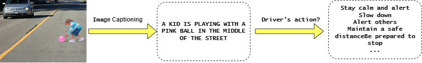

# Image Captioning with Transformers : Critical Autonomous Driving Scenarios 
In this workshop, we will run the inference of OFA on image captioning with Huggingface Transformers.The goal is to develop a model that can effectively describe a given scene related to safety-critical situations, such as traffic accidents or emergency response scenarios and provide a possible solution to handle the hazardous situation. What you need to do is to use an input image with some simple preprocessing, build the model and generator and obtain the imgage captioning text. The text will be used as prompting to GPT4all to generate an answer. 



## Task Description

👉🏻 OFA MODELS & DESCRIPTION GENERATION: Use various OFA Model with Hugging Face Transformers to develop a model capable of generating descriptive text based on the provided scene inputs. Feel free to choose from various model architectures, such as tiny, base, or huge OFA. Utilize the trained Transformer model to generate textual descriptions for the given safety-critical scenarios and run experiments with different techniques, for generating diverse descriptions to handle the critical scenario.

👉🏻 INPUT : Four images from various safety critical situation in autonomous drivind domain.

👉🏻 EVALUATION AND COMPARISON: Evaluate the quality of generated descriptions in relation to the applied model.

👉🏻 PRESENTATION AND DISCUSSION: Present your findings, including the techniques used, challenges faced, and insights gained during the development process. Discuss the strengths and limitations of the models and propose potential improvements or alternative approaches to enhance the description generation for safety-critical scenarios.


 
## How To 👩🏻‍💻👨🏻‍💻
Different versions of OFA pretrained models will be integrated to achieve the best result. To use it in transformers,the transformer needs to be installed and the model should be downloaded. please refer to https://github.com/OFA-Sys/OFA/tree/feature/add_transformers for more information

Run the following steps in your Google Colab:

### Installation and preparation : OFA

```python
!pip install pytorch-transformers
!pip -q install git+https://github.com/huggingface/transformers
!pip -q install accelerate>=0.12.0
!pip install OFA/transformers/
!git lfs install

# Select the model for evaluation : https://huggingface.co/OFA-Sys

!git clone --single-branch --branch feature/add_transformers https://github.com/OFA-Sys/OFA.git
!git clone https://huggingface.co/OFA-Sys/OFA-tiny
```
### Prepare your image as input to the model
```python
from PIL import Image
from torchvision import transforms
from transformers import OFATokenizer, OFAModel
from transformers.models.ofa.generate import sequence_generator

mean, std = [0.5, 0.5, 0.5], [0.5, 0.5, 0.5]
resolution = 256

patch_resize_transform = transforms.Compose([
    lambda image: image.convert("RGB"),
    transforms.Resize((resolution, resolution), interpolation=Image.BICUBIC),
    transforms.ToTensor(), 
    transforms.Normalize(mean=mean, std=std)
])
```
### Load the right checkpoint based on your model 
```python
ckpt_dir='./OFA-tiny'
tokenizer = OFATokenizer.from_pretrained(ckpt_dir)
```
### Generate a caption 
```python
txt = " what does the image describe?"
inputs = tokenizer([txt], return_tensors="pt").input_ids
# Create a folder in your google drive ( name it Data) and save the samlpe images
img = Image.open('./Data/[IMAGENAME].jpg')
patch_img = patch_resize_transform(img).unsqueeze(0)

model = OFAModel.from_pretrained(ckpt_dir, use_cache=False)

generator = sequence_generator.SequenceGenerator(
    tokenizer=tokenizer,
    beam_size=5,
    max_len_b=16,
    min_len=0,
    no_repeat_ngram_size=3,
)

import torch
data = {}
data["net_input"] = {"input_ids": inputs, 'patch_images': patch_img, 'patch_masks':torch.tensor([True])}

gen_output = generator.generate([model], data)
gen = [gen_output[i][0]["tokens"] for i in range(len(gen_output))]
Context = tokenizer.batch_decode(gen, skip_special_tokens=True)[0].strip()
print (Context)

display(img)
print(tokenizer.batch_decode(gen, skip_special_tokens=True)[0].strip())
```
### Installation and preparation : GPT4all

```python
!pip install -q huggingface_hub pyllamacpp
!pip install --upgrade pygpt4all==1.0.1

from huggingface_hub import hf_hub_download
from pyllamacpp.model import Model

#Download the model
hf_hub_download(repo_id="LLukas22/gpt4all-lora-quantized-ggjt", filename="ggjt-model.bin", local_dir=".")

#Load the model
model = Model(ggml_model="ggjt-model.bin", n_ctx=512)

#Generate
prompt="User: what should the driver do if {} \nBot:".format(Context)
# Hint : change the n_predict number 
result=model.generate(prompt,n_predict=50)
print(result)
```


<picture>
  <source media="(prefers-color-scheme: dark)" srcset="https://user-images.githubusercontent.com/25423296/163456776-7f95b81a-f1ed-45f7-b7ab-8fa810d529fa.png">
  <source media="(prefers-color-scheme: light)" srcset="https://user-images.githubusercontent.com/25423296/163456779-a8556205-d0a5-45e2-ac17-42d089e3c3f8.png">
  
</picture>


## Useful Links & References

https://github.com/OFA-Sys/OFA

https://github.com/nomic-ai/gpt4all

https://huggingface.co/docs/transformers/index
